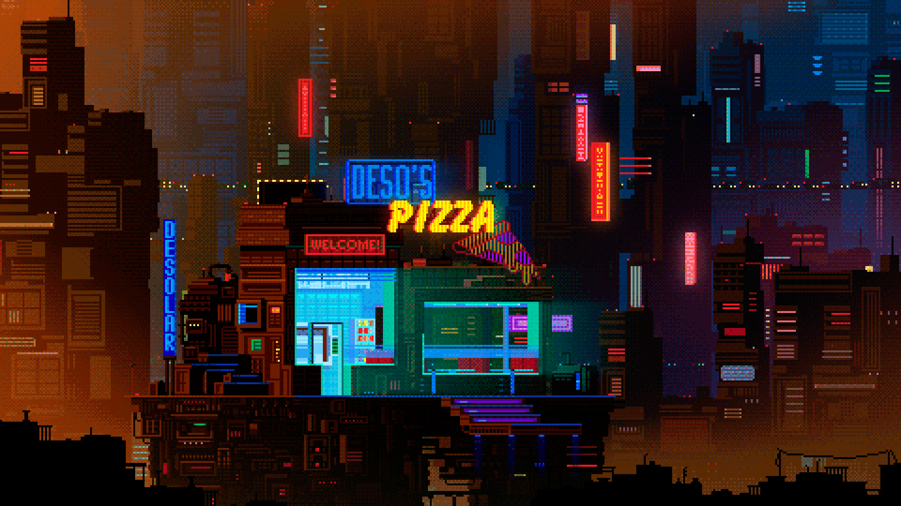

<!--  -->

    <h1 align="left">🌏ZebSun</h1>
    

**`初级前端开发爱好者 在读学生 [ZebSun|INTJ]`**

Welcome to my GitHub profile, I'm ZebSun! As a highly motivated and disciplined computer science student, I am deeply committed to pursuing a career in Web development. Through a combination of self-study and collaboration with my peers, I am continuously working to hone my skills and achieve my goal of becoming a Web Front-End Developer. 

# 

